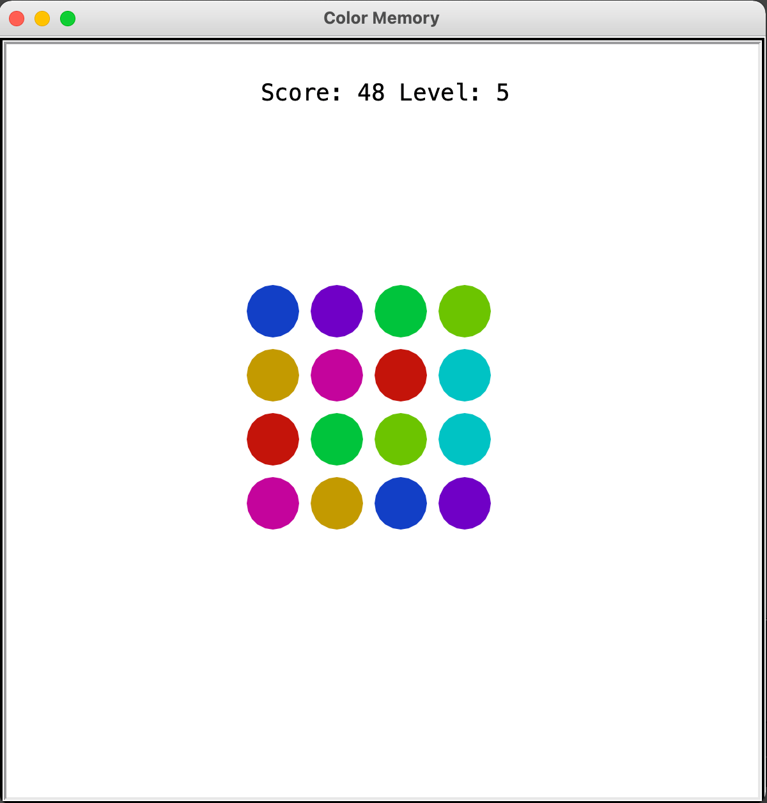

# Color-Memory-Game

This is a version of the classic memory game, but using colors only. Test your memory and color vision! With each level, the number of colors increases. They become harder to distinguish, but at least you get extra time to complete the level. You score points for each color match and for the seconds left when you complete a level.

Enjoy!

